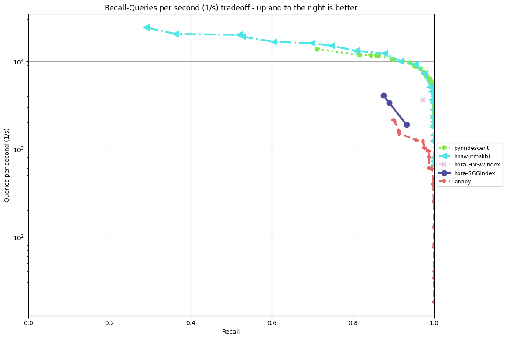

<div align="center">
  
</div>

# Hora

**[[Homepage](http://horasearch.com/)]** **[[Document](https://horasearch.com/doc)]** **[[Examples](https://horasearch.com/doc/example.html)]**

***Hora Search Everywhere!***

Hora, a **approximate nearest neighbor search algorithm** library. We implement all code in `Rust🦀` for reliability, high level abstraction and high speed comparable to `C++`.

Hora, **`「ほら」`** in Japanese, sound like `[hōlə]`, means `Wow`, `You see!` or `Look at that!`. The name is inspired by a famous Japanese song **`「小さな恋のうた」`**.

# Key Features

* **Performant** ⚡️
  * **SIMD-Accelerated ([packed_simd](https://github.com/rust-lang/packed_simd))**
  * **Stable algorithm implementation**
  * **Multiple threads design**

* **Multiple Languages Support** ☄️
  * `Python`
  * `Javascript`
  * `Java`
  * `Go` (WIP)
  * `Ruby` (WIP)
  * `Swift` (WIP)
  * `R` (WIP)
  * `Julia` (WIP)
  * **also can serve as a service**

* **Multiple Indexes Support** 🚀
  * `Hierarchical Navigable Small World Graph Index(HNSWIndex)` ([detail](https://arxiv.org/abs/1603.09320))
  * `Satellite System Graph (SSGIndex)` ([detail](https://arxiv.org/abs/1907.06146))
  * `Product Quantization Inverted File(PQIVFIndex)` ([detail](https://lear.inrialpes.fr/pubs/2011/JDS11/jegou_searching_with_quantization.pdf))
  * `Random Projection Tree(RPTIndex)` (LSH, WIP)
  * `BruteForce (BruteForceIndex)` (naive implementation with SIMD)

* **Portable** 💼
  * Support `no_std` (WIP, partial)
  * Support `Windows`, `Linux` and `OS X`
  * Support `IOS` and `Android` (WIP)
  * **No** heavy dependency, such as `BLAS`

* **Reliability** 🔒
  * `Rust` compiler secure all code
  * Memory managed by `Rust` for all language libs such as `Python lib`
  * Broad testing coverage

* **Multiple Distances Support** 🧮
  * `Dot Product Distance`
    * 
  * `Euclidean Distance`
    * 
  * `Manhattan Distance`
    * 
  * `Cosine Similarity`
    * 

* **Productive** ⭐
  * Well documented
  * Elegant and simple API, easy to learn

# Installation

**`Rust`**

in `Cargo.toml`

```toml
[dependencies]
hora = "0.1.0"
```

**`Python`**

```Bash
$ pip install horapy
```

**`Building from source`**

```bash
$ git clone https://github.com/hora-search/hora
$ cargo build
```

# Benchmark


by `aws t2.medium (CPU: Intel(R) Xeon(R) CPU E5-2686 v4 @ 2.30GHz)` [more information](https://github.com/hora-search/ann-benchmarks)

# Examples

**`Rust` example** [[more info](https://github.com/hora-search/hora/tree/main/examples)]

```Rust 
use hora::core::ann_index::ANNIndex;
use rand::{thread_rng, Rng};
use rand_distr::{Distribution, Normal};

pub fn demo() {
    let n = 1000;
    let dimension = 64;

    // make sample points
    let mut samples = Vec::with_capacity(n);
    let normal = Normal::new(0.0, 10.0).unwrap();
    for _i in 0..n {
        let mut sample = Vec::with_capacity(dimension);
        for _j in 0..dimension {
            sample.push(normal.sample(&mut rand::thread_rng()));
        }
        samples.push(sample);
    }

    // init index
    let mut index = hora::index::hnsw_idx::HNSWIndex::<f32, usize>::new(
        dimension,
        &hora::index::hnsw_params::HNSWParams::<f32>::default(),
    );
    for (i, sample) in samples.iter().enumerate().take(n) {
        // add point
        index.add(sample, i).unwrap();
    }
    index.build(hora::core::metrics::Metric::Euclidean).unwrap();

    let mut rng = thread_rng();
    let target: usize = rng.gen_range(0..n);
    // 523 has neighbors: [523, 762, 364, 268, 561, 231, 380, 817, 331, 246]
    println!(
        "{:?} has neighbors: {:?}",
        target,
        index.search(&samples[target], 10) // search for k nearest neighbors
    );
}
```

**`Python` exmaple** [[more info](https://github.com/hora-search/horapy)]

```Python
import numpy as np
from horapy import HNSWIndex

dimension = 50
n = 1000

# init index instance
index = HNSWIndex(dimension, "usize")

samples = np.float32(np.random.rand(n, dimension))
for i in range(0, len(samples)):
    # add node
    index.add(np.float32(samples[i]), i)

index.build("euclidean")  # build index

target = np.random.randint(0, n)
# 410 in Hora ANNIndex <HNSWIndexUsize> (dimension: 50, dtype: usize, max_item: 1000000, n_neigh: 32, n_neigh0: 64, ef_build: 20, ef_search: 500, has_deletion: False)
# has neighbors: [410, 736, 65, 36, 631, 83, 111, 254, 990, 161]
print("{} in {} \nhas neighbors: {}".format(
    target, index, index.search(samples[target], 10)))  # search

```

**`Javascript` example** [[more info](https://github.com/hora-search/hora-wasm)]

```JavaScript
const demo = () => {
  const dimension = 50;

  var bf_idx = hora_wasm.BruteForceIndexUsize.new(dimension);
  for (var i = 0; i < 1000; i++) {
    var feature = [];
    for (var j = 0; j < dimension; j++) {
      feature.push(Math.random());
    }
    bf_idx.add(feature, i); // add point 
  }
  bf_idx.build("euclidean"); // build index
  var feature = [];
  for (var j = 0; j < dimension; j++) {
    feature.push(Math.random());
  }
  console.log("bf result",  .search(feature, 10)); //bf result Uint32Array(10) [704, 113, 358, 835, 408, 379, 117, 414, 808, 826]
}
```

**`Java` examples** [[more info](https://github.com/hora-search/hora-java)]

```Java
public void demo() {
    final int dimension = 2;
    final float variance = 2.0f;
    Random fRandom = new Random();

    BruteForceIndex bruteforce_idx = new BruteForceIndex(dimension); // init index instance

    List<float[]> tmp = new ArrayList<>();
    for (int i = 0; i < 5; i++) {
        for (int p = 0; p < 10; p++) {
            float[] features = new float[dimension];
            for (int j = 0; j < dimension; j++) {
                features[j] = getGaussian(fRandom, (float) (i * 10), variance);
            }
            bruteforce_idx.add("bf", features, i * 10 + p); // add point
            tmp.add(features);
          }
    }
    bruteforce_idx.build("bf", "euclidean"); // build index

    int search_index = fRandom.nextInt(tmp.size());
    // nearest neighbor search
    int[] result = bruteforce_idx.search("bf", 10, tmp.get(search_index)); 
    // [main] INFO com.hora.app.ANNIndexTest  - demo bruteforce_idx[7, 8, 0, 5, 3, 9, 1, 6, 4, 2]
    log.info("demo bruteforce_idx" + Arrays.toString(result)); 
}

private static float getGaussian(Random fRandom, float aMean, float variance) {
    float r = (float) fRandom.nextGaussian();
    return aMean + r * variance;
}
```

# Roadmap

- [ ] Full Coverage Test
- [ ] implement [EFANNA](http://arxiv.org/abs/1609.07228) algo to achieve faster KNN graph building
- [ ] Swift Support and also IOS/Mac OS deployment example
- [ ] Support `R` 
- [ ] support `mmap`

# Related Projects and Comparison

* [Faiss](https://github.com/facebookresearch/faiss), [Annoy](https://github.com/spotify/annoy), [ScaNN](https://github.com/google-research/google-research/tree/master/scann): 
  * **`Hora`'s implementation is strongly inspired by these lib.**
  * `Faiss` focus more on the GPu scenerio, and `Hora` is lighter than Faiss, such as **no heavy dependency**.
  * `Hora` expects to support more language, and everything related to performance shall be implemented by Rust🦀.
  * `Annoy` only support `LSH(Random Projection)` algorithm.
  * `ScaNN` and `Faiss` are less user-friendly, such as lack of document.
  * Hora is **ALL IN RUST** 🦀.

* [Milvus](https://github.com/milvus-io/milvus), [Vald](https://github.com/vdaas/vald), [Jina AI](https://github.com/jina-ai/jina)
  * `Milvus` and `Vald` also support multiple languages, but serve as a service instead of a lib
  * `Milvus` is built upon some libs such as `Faiss`, while `Hora` is an algorithm lib with all the algo implemented by itself

# Contribute

**We appreciate your help!**

we are pretty gald to have you to participate, any contributions is welcome, including the documentations and tests.
you can do the  `Pull Requests`, `Issue` on the github, and we will review it as soon as possible.

We use GitHub issues for tracking suggestions and bugs.

#### clone the repo

```bash
# clone to local
git clone https://github.com/hora-search/hora

## build
cargo build
## test
cargo test --lib
```

#### try changes

```bash
cd exmaples
cargo run
```

# License

The entire repo is under [Apache License](https://github.com/hora-search/hora/blob/main/LICENSE).
