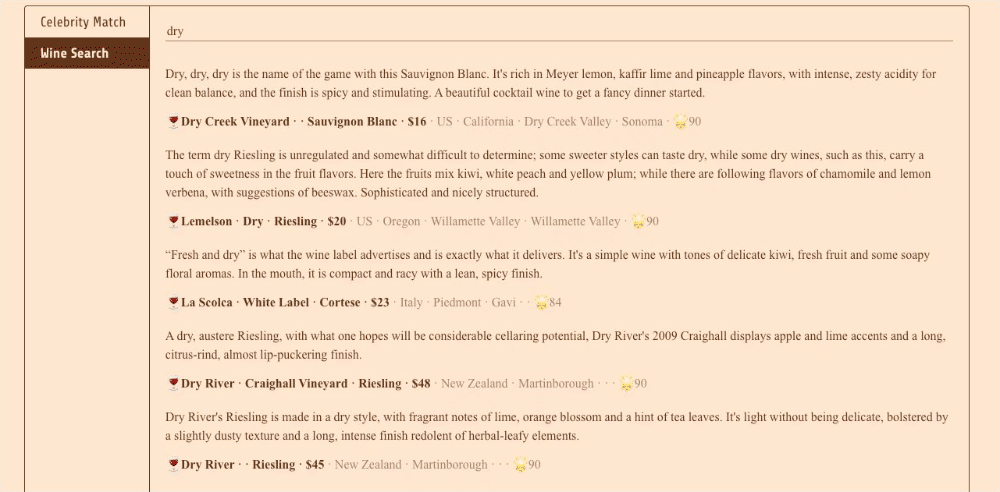

<div align="center">
  
</div>

# Hora

**[[Homepage](http://horasearch.com/)]** **[[Document](https://horasearch.com/doc)]** **[[Examples](https://horasearch.com/doc/example.html)]**

**_Hora Search Everywhere!_**

Horaは**近似最近傍探索アルゴリズムライブラリ** [[Wikipedia](https://ja.wikipedia.org/wiki/%E6%9C%80%E8%BF%91%E5%82%8D%E6%8E%A2%E7%B4%A2)]です。 信頼性、高レベルの抽象化、および `C++`に匹敵する高速性を達成するために、すべてのコードを`Rust🦀`で実装しています。

日本語で「ほら」は、`[hōlə]`のように聞こえます。この名前は、日本の歌「小さな恋のうた」の有名な歌詞「ほら あなたにとって大事な人ほど すぐそばにいるの」にちなんで付けられました。

# デモ

**👩 Face-Match [[online demo](https://horasearch.com/#Demos)]**

<div align="center">
  
</div>

**🍷 Dream wine comments search [[online demo](https://horasearch.com/#Demos)]**

<div align="center">
  
</div>

# 特徴

- **性能** ⚡️

  - **SIMD アクセラレーション ([packed_simd](https://github.com/rust-lang/packed_simd))**
  - **安定したアルゴリズムの実装**
  - **マルチスレッドデザイン**

- **複数のプログラミング言語をサポート** ☄️

  - `Python`
  - `Javascript`
  - `Java`
  - `Go` (WIP)
  - `Ruby` (WIP)
  - `Swift` (WIP)
  - `R` (WIP)
  - `Julia` (WIP)
  - **サービスとしても使用可能**

- **複数のインデックスをサポート** 🚀

  - `Hierarchical Navigable Small World Graph Index (HNSWIndex)` ([details](https://arxiv.org/abs/1603.09320))
  - `Satellite System Graph (SSGIndex)` ([details](https://arxiv.org/abs/1907.06146))
  - `Product Quantization Inverted File(PQIVFIndex)` ([details](https://lear.inrialpes.fr/pubs/2011/JDS11/jegou_searching_with_quantization.pdf))
  - `Random Projection Tree(RPTIndex)` (LSH, WIP)
  - `BruteForce (BruteForceIndex)` (SIMDを使った素朴な実装)

- **移植性** 💼

  - `WebAssembly`対応
  - `Windows`、`Linux`および`OS X`に対応
  - `iOS`および`Android`対応 (WIP)
  - `no_std`対応 (WIP, partial)
  - `BLAS`などの大きな依存関係は**ありません**

- **信頼性** 🔒

  - `Rust`コンパイラはすべてのコードを保護します
  - `Python`などの全ての言語向けのライブラリで`Rust`によるメモリ管理
  - 幅広いテスト範囲

- **複数の距離をサポート** 🧮

  - `Dot Product Distance`
    - 
  - `Euclidean Distance`
    - 
  - `Manhattan Distance`
    - 
  - `Cosine Similarity`
    - 

- **生産性** ⭐
  - 整備されたドキュメント
  - エレガントかつシンプル、そして習得しやすいAPI

# インストール

`Cargo.toml`で

```toml
[dependencies]
hora = "0.1.1"
```

**`Python`**

```Bash
$ pip install horapy
```

**`Javascript (WebAssembly)`**

```Bash
$ npm i horajs
```

**`ソースコードからビルド`**

```bash
$ git clone https://github.com/hora-search/hora
$ cargo build
```

# ベンチマーク


by `aws t2.medium (CPU: Intel(R) Xeon(R) CPU E5-2686 v4 @ 2.30GHz)` [more information](https://github.com/hora-search/ann-benchmarks)

# Examples

**`Rust`** [[詳細](https://github.com/hora-search/hora/tree/main/examples)]

```Rust
use hora::core::ann_index::ANNIndex;
use rand::{thread_rng, Rng};
use rand_distr::{Distribution, Normal};

pub fn demo() {
    let n = 1000;
    let dimension = 64;

    // make sample points
    let mut samples = Vec::with_capacity(n);
    let normal = Normal::new(0.0, 10.0).unwrap();
    for _i in 0..n {
        let mut sample = Vec::with_capacity(dimension);
        for _j in 0..dimension {
            sample.push(normal.sample(&mut rand::thread_rng()));
        }
        samples.push(sample);
    }

    // init index
    let mut index = hora::index::hnsw_idx::HNSWIndex::<f32, usize>::new(
        dimension,
        &hora::index::hnsw_params::HNSWParams::<f32>::default(),
    );
    for (i, sample) in samples.iter().enumerate().take(n) {
        // add point
        index.add(sample, i).unwrap();
    }
    index.build(hora::core::metrics::Metric::Euclidean).unwrap();

    let mut rng = thread_rng();
    let target: usize = rng.gen_range(0..n);
    // 523 has neighbors: [523, 762, 364, 268, 561, 231, 380, 817, 331, 246]
    println!(
        "{:?} has neighbors: {:?}",
        target,
        index.search(&samples[target], 10) // search for k nearest neighbors
    );
}
```

この完全な純粋な錆画像検索の[コード例](https://github.com/vaaaaanquish/rust-ann-search-example)を公開して下さった@vaaaaanquish様に感謝申し上げます。この例の詳細については、[Pure Rustな近似最近傍探索ライブラリhoraを用いた画像検索を実装する](https://vaaaaaanquish.hatenablog.com/entry/2021/08/10/065117)をご覧ください。

**`Python`** [[詳細](https://github.com/hora-search/horapy)]

```Python
import numpy as np
from horapy import HNSWIndex

dimension = 50
n = 1000

# init index instance
index = HNSWIndex(dimension, "usize")

samples = np.float32(np.random.rand(n, dimension))
for i in range(0, len(samples)):
    # add node
    index.add(np.float32(samples[i]), i)

index.build("euclidean")  # build index

target = np.random.randint(0, n)
# 410 in Hora ANNIndex <HNSWIndexUsize> (dimension: 50, dtype: usize, max_item: 1000000, n_neigh: 32, n_neigh0: 64, ef_build: 20, ef_search: 500, has_deletion: False)
# has neighbors: [410, 736, 65, 36, 631, 83, 111, 254, 990, 161]
print("{} in {} \nhas neighbors: {}".format(
    target, index, index.search(samples[target], 10)))  # search

```

**`JavaScript`** [[詳細](https://github.com/hora-search/hora-wasm)]

```JavaScript
import * as horajs from "horajs";

const demo = () => {
    const dimension = 50;
    var bf_idx = horajs.BruteForceIndexUsize.new(dimension);
    // var hnsw_idx = horajs.HNSWIndexUsize.new(dimension, 1000000, 32, 64, 20, 500, 16, false);
    for (var i = 0; i < 1000; i++) {
        var feature = [];
        for (var j = 0; j < dimension; j++) {
            feature.push(Math.random());
        }
        bf_idx.add(feature, i); // add point
    }
    bf_idx.build("euclidean"); // build index
    var feature = [];
    for (var j = 0; j < dimension; j++) {
        feature.push(Math.random());
    }
    console.log("bf result", bf_idx.search(feature, 10)); //bf result Uint32Array(10) [704, 113, 358, 835, 408, 379, 117, 414, 808, 826]
}

(async () => {
    await horajs.default();
    await horajs.init_env();
    demo();
})();
```

**`Java`** [[詳細](https://github.com/hora-search/hora-java)]

```Java
public void demo() {
    final int dimension = 2;
    final float variance = 2.0f;
    Random fRandom = new Random();

    BruteForceIndex bruteforce_idx = new BruteForceIndex(dimension); // init index instance

    List<float[]> tmp = new ArrayList<>();
    for (int i = 0; i < 5; i++) {
        for (int p = 0; p < 10; p++) {
            float[] features = new float[dimension];
            for (int j = 0; j < dimension; j++) {
                features[j] = getGaussian(fRandom, (float) (i * 10), variance);
            }
            bruteforce_idx.add("bf", features, i * 10 + p); // add point
            tmp.add(features);
          }
    }
    bruteforce_idx.build("bf", "euclidean"); // build index

    int search_index = fRandom.nextInt(tmp.size());
    // nearest neighbor search
    int[] result = bruteforce_idx.search("bf", 10, tmp.get(search_index));
    // [main] INFO com.hora.app.ANNIndexTest  - demo bruteforce_idx[7, 8, 0, 5, 3, 9, 1, 6, 4, 2]
    log.info("demo bruteforce_idx" + Arrays.toString(result));
}

private static float getGaussian(Random fRandom, float aMean, float variance) {
    float r = (float) fRandom.nextGaussian();
    return aMean + r * variance;
}
```

# ロードマップ

- [ ] 完全なテストカバレッジ
- [ ] [EFANNA](http://arxiv.org/abs/1609.07228)アルゴリズムを実装して、より高速なKNNグラフ構築を実現する
- [ ] SwiftのサポートとiOS/macOSのデプロイ例
- [ ] `R`のサポート
- [ ] `mmap`のサポート

# 関連プロジェクトと比較

- [Faiss](https://github.com/facebookresearch/faiss), [Annoy](https://github.com/spotify/annoy), [ScaNN](https://github.com/google-research/google-research/tree/master/scann):

  - **Hora の実装は、これらのライブラリに強く影響を受けています。**
  - `Faiss`はGPUの使用に重点を置いており、`Hora`はFaissよりも軽量です **(大きな依存関係はありません)**。
  - `Hora`はより多くの言語をサポートすることを期待しており、パフォーマンスに関連する部分は全てRustで実装しています🦀
  - `Annoy`は`LSH(Random Projection)`アルゴリズムのみをサポートします。
  - `ScaN`と`Fats`はドキュメントなどの面においてユーザーフレンドリーではありません
  - Hora is **ALL IN RUST** 🦀 (Horaは**全てRustで実装しています**🦀)

- [Milvus](https://github.com/milvus-io/milvus), [Vald](https://github.com/vdaas/vald), [Jina AI](https://github.com/jina-ai/jina)
  - `Milvus`と` Vald`も複数の言語をサポートしていますが、ライブラリではなくサービスとして機能します
  - `Milvus`は`Faiss`などのいくつかのライブラリにの上に成り立っていますが、 `Hora`ではすべてのアルゴリズムが実装されています。

# 貢献に参加する

**We appreciate your participation!**

皆様のご参加をお待ちしております。ドキュメントやテストなど、あらゆる貢献を歓迎します。
GitHub でPull RequestsまたはIssuesを作成できます。できるだけ早く確認します。

提案やバグを管理するためにGitHubのIssuesを使用します。

#### リポジトリのclone

```bash
git clone https://github.com/hora-search/hora
```

#### ビルド

```bash
cargo build
```

#### テスト

```bash
cargo test --lib
```

#### 変更の確認

```bash
cd examples
cargo run
```

# ライセンス

このリポジトリは[Apache License](https://github.com/hora-search/hora/blob/main/LICENSE)でライセンスされています。
