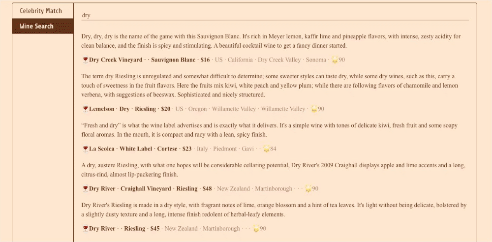
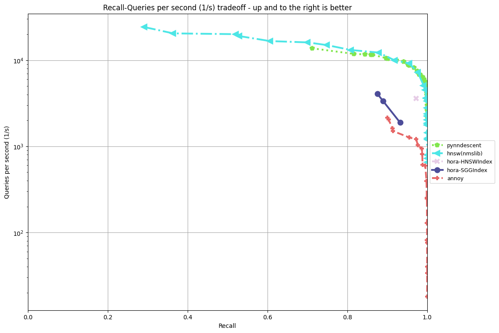

<!-- This file was automatically generated by Nanolaba Readme Generator (NRG) 1.1 -->
<!-- Visit https://github.com/nanolaba/readme-generator for details -->
<div align="center">
  
</div>

# Hora

**[[Homepage](http://horasearch.com/)]** **[[Document](https://horasearch.com/doc)]** **[[Examples](https://horasearch.com/doc/example.html)]**

**_Hora Search Everywhere!_**

Hora는 **근접 이웃 검색 알고리즘**([wiki](https://en.wikipedia.org/wiki/Nearest_neighbor_search)) 라이브러리입니다. 우리는 `C++` 에 필적하는 신뢰성, 높은 수준의 추상화 및 고속을 위해 `Rust🦀 `에서 모든 코드를 구현합니다.

Hora, `「ほら」`는 일본어로 `[hōlə]`처럼 들리며 `와우`, `알겠습니다!` 또는 `저걸 봐!`를 의미합니다. 이름은 유명한 일본 노래 `「小さな恋のうた」`에서 영감을 받았습니다.

# Demos

**👩 Face-Match [[online demo](https://horasearch.com/#Demos)], have a try!**

<div align="center">
  
</div>

**🍷 Dream wine comments search [[online demo](https://horasearch.com/#Demos)], have a try!**

<div align="center">
  
</div>

# Features

- **Performant** ⚡️

  - **SIMD-Accelerated ([packed_simd](https://github.com/rust-lang/packed_simd))**
  - **Stable algorithm implementation**
  - **Multiple threads design**

- **Supports Multiple Languages** ☄️

  - `Python`
  - `Javascript`
  - `Java`
  - `Go` (WIP)
  - `Ruby` (WIP)
  - `Swift` (WIP)
  - `R` (WIP)
  - `Julia` (WIP)
  - **Can also be used as a service**

- **Supports Multiple Indexes** 🚀

  - `Hierarchical Navigable Small World Graph Index (HNSWIndex)` ([details](https://arxiv.org/abs/1603.09320))
  - `Satellite System Graph (SSGIndex)` ([details](https://arxiv.org/abs/1907.06146))
  - `Product Quantization Inverted File(PQIVFIndex)` ([details](https://lear.inrialpes.fr/pubs/2011/JDS11/jegou_searching_with_quantization.pdf))
  - `Random Projection Tree(RPTIndex)` (LSH, WIP)
  - `BruteForce (BruteForceIndex)` (naive implementation with SIMD)

- **Portable** 💼
  - Supports `WebAssembly`
  - Supports `Windows`, `Linux` and `OS X`
  - Supports `IOS` and `Android` (WIP)
  - Supports `no_std` (WIP, partial)
  - **No** heavy dependencies, such as `BLAS`

- **Reliability** 🔒

  - `Rust` compiler secures all code
  - Memory managed by `Rust` for all language libraries such as `Python's`
  - Broad testing coverage

- **Supports Multiple Distances** 🧮

  - `Dot Product Distance`
    - 
  - `Euclidean Distance`
    - 
  - `Manhattan Distance`
    - 
  - `Cosine Similarity`
    - 

- **Productive** ⭐
  - Well documented
  - Elegant, simple and easy to learn API

# Installation

**`Rust`**

in `Cargo.toml`

```toml
[dependencies]
hora = "0.1.1"
```

**`Python`**

```Bash
$ pip install horapy
```

**`Javascript (WebAssembly)`**

```Bash
$ npm i horajs
```

**`Building from source`**

```bash
$ git clone https://github.com/hora-search/hora
$ cargo build
```

# Benchmarks



by `aws t2.medium (CPU: Intel(R) Xeon(R) CPU E5-2686 v4 @ 2.30GHz)` [more information](https://github.com/hora-search/ann-benchmarks)

# Examples

**`Rust` example** [[more info](https://github.com/hora-search/hora/tree/main/examples)]

```Rust
use hora::core::ann_index::ANNIndex;
use rand::{thread_rng, Rng};
use rand_distr::{Distribution, Normal};

pub fn demo() {
    let n = 1000;
    let dimension = 64;

    // make sample points
    let mut samples = Vec::with_capacity(n);
    let normal = Normal::new(0.0, 10.0).unwrap();
    for _i in 0..n {
        let mut sample = Vec::with_capacity(dimension);
        for _j in 0..dimension {
            sample.push(normal.sample(&mut rand::thread_rng()));
        }
        samples.push(sample);
    }

    // init index
    let mut index = hora::index::hnsw_idx::HNSWIndex::<f32, usize>::new(
        dimension,
        &hora::index::hnsw_params::HNSWParams::<f32>::default(),
    );
    for (i, sample) in samples.iter().enumerate().take(n) {
        // add point
        index.add(sample, i).unwrap();
    }
    index.build(hora::core::metrics::Metric::Euclidean).unwrap();

    let mut rng = thread_rng();
    let target: usize = rng.gen_range(0..n);
    // 523 has neighbors: [523, 762, 364, 268, 561, 231, 380, 817, 331, 246]
    println!(
        "{:?} has neighbors: {:?}",
        target,
        index.search(&samples[target], 10) // search for k nearest neighbors
    );
}
```

thank @vaaaaanquish for this complete pure rust image search [example](https://github.com/vaaaaanquish/rust-ann-search-example), For more information about this example, please can click [Pure Rustな近似最近傍探索ライブラリhoraを用いた画像検索を実装する](https://vaaaaaanquish.hatenablog.com/entry/2021/08/10/065117)

**`Python` example** [[more info](https://github.com/hora-search/horapy)]

```Python
import numpy as np
from horapy import HNSWIndex

dimension = 50
n = 1000

# init index instance
index = HNSWIndex(dimension, "usize")

samples = np.float32(np.random.rand(n, dimension))
for i in range(0, len(samples)):
    # add node
    index.add(np.float32(samples[i]), i)

index.build("euclidean")  # build index

target = np.random.randint(0, n)
# 410 in Hora ANNIndex <HNSWIndexUsize> (dimension: 50, dtype: usize, max_item: 1000000, n_neigh: 32, n_neigh0: 64, ef_build: 20, ef_search: 500, has_deletion: False)
# has neighbors: [410, 736, 65, 36, 631, 83, 111, 254, 990, 161]
print("{} in {} \nhas neighbors: {}".format(
    target, index, index.search(samples[target], 10)))  # search

```

**`JavaScript` example** [[more info](https://github.com/hora-search/hora-wasm)]

```JavaScript
import * as horajs from "horajs";

const demo = () => {
    const dimension = 50;
    var bf_idx = horajs.BruteForceIndexUsize.new(dimension);
    // var hnsw_idx = horajs.HNSWIndexUsize.new(dimension, 1000000, 32, 64, 20, 500, 16, false);
    for (var i = 0; i < 1000; i++) {
        var feature = [];
        for (var j = 0; j < dimension; j++) {
            feature.push(Math.random());
        }
        bf_idx.add(feature, i); // add point 
    }
    bf_idx.build("euclidean"); // build index
    var feature = [];
    for (var j = 0; j < dimension; j++) {
        feature.push(Math.random());
    }
    console.log("bf result", bf_idx.search(feature, 10)); //bf result Uint32Array(10) [704, 113, 358, 835, 408, 379, 117, 414, 808, 826]
}

(async () => {
    await horajs.default();
    await horajs.init_env();
    demo();
})();
```

**`Java` example** [[more info](https://github.com/hora-search/hora-java)]

```Java
public void demo() {
    final int dimension = 2;
    final float variance = 2.0f;
    Random fRandom = new Random();

    BruteForceIndex bruteforce_idx = new BruteForceIndex(dimension); // init index instance

    List<float[]> tmp = new ArrayList<>();
    for (int i = 0; i < 5; i++) {
        for (int p = 0; p < 10; p++) {
            float[] features = new float[dimension];
            for (int j = 0; j < dimension; j++) {
                features[j] = getGaussian(fRandom, (float) (i * 10), variance);
            }
            bruteforce_idx.add("bf", features, i * 10 + p); // add point
            tmp.add(features);
          }
    }
    bruteforce_idx.build("bf", "euclidean"); // build index

    int search_index = fRandom.nextInt(tmp.size());
    // nearest neighbor search
    int[] result = bruteforce_idx.search("bf", 10, tmp.get(search_index));
    // [main] INFO com.hora.app.ANNIndexTest  - demo bruteforce_idx[7, 8, 0, 5, 3, 9, 1, 6, 4, 2]
    log.info("demo bruteforce_idx" + Arrays.toString(result));
}

private static float getGaussian(Random fRandom, float aMean, float variance) {
    float r = (float) fRandom.nextGaussian();
    return aMean + r * variance;
}
```

# Roadmap

- [ ] 전체 테스트 범위
- [ ] 더 빠른 KNN 그래프 구축을 달성하기 위해 [EFANNA](http://arxiv.org/abs/1609.07228) 알고리즘 구현
- [ ] Swift 지원 및 `iOS`/`macOS` 배포 예시
- [ ] 지원 `R`
- [ ] `mmap` 지원

# Related Projects and Comparison

- [Faiss](https://github.com/facebookresearch/faiss), [Annoy](https://github.com/spotify/annoy), [ScaNN](https://github.com/google-research/google-research/tree/master/scann):

  - **`Hora`의 구현은 이러한 라이브러리에서 크게 영감을 받았습니다.**
  - `Faiss`는 GPU 장면에 더 중점을 두고 `Hora`는 Faiss보다 가볍습니다(**중대한 종속성 없음)**.
  - `Hora`는 더 많은 언어를 지원할 예정이며 성능과 관련된 모든 것은 Rust🦀에서 구현됩니다.
  - `Annoy`는 ``LSH (Random Projection)` 알고리즘만 지원합니다.
  - `ScaNN` 및 `Faiss`는 사용자 친화적이지 않습니다(예: 문서 부족).
  - Hora is **ALL IN RUST** 🦀.

- [Milvus](https://github.com/milvus-io/milvus), [Vald](https://github.com/vdaas/vald), [Jina AI](https://github.com/jina-ai/jina)
  - 'Milvus'와 'Vald'도 여러 언어를 지원하지만 라이브러리 대신 서비스 역할을 합니다.
  - 'Milvus'는 'Faiss'와 같은 일부 라이브러리를 기반으로 하는 반면, 'Hora'는 모든 알고리즘이 자체적으로 구현된 라이브러리입니다.

# Contribute

**We appreciate your help!**

문서 및 테스트를 포함하여 모든 기여를 환영합니다.
GitHub에서 `Pull Request` 또는 `Issue` 를 생성할 수 있으며 최대한 빨리 검토하겠습니다.

제안 및 버그를 추적하기 위해 GitHub 문제를 사용합니다.

#### Clone the repo

```bash
git clone https://github.com/hora-search/hora
```

#### Build

```bash
cargo build
```

#### Test

```bash
cargo test --lib
```

#### Try the changes

```bash
cd examples
cargo run
```

# License

The entire repository is licensed under the [Apache License](https://github.com/hora-search/hora/blob/main/LICENSE).
